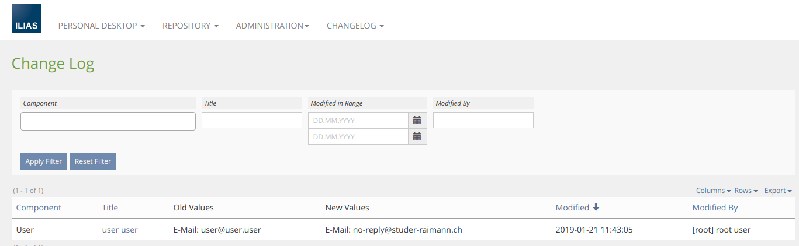

## Installation

### Install ChangeLog-Plugin
Start at your ILIAS root directory
```bash
mkdir -p Customizing/global/plugins/Services/UIComponent/UserInterfaceHook
cd Customizing/global/plugins/Services/UIComponent/UserInterfaceHook
git clone https://github.com/studer-raimann/ChangeLog.git ChangeLog
```
Update, activate and config the plugin in the ILIAS Plugin Administration

### Menu (Only ILIAS 5.3)
For ILIAS 5.3, you need to install [CtrlMainMenu](https://github.com/studer-raimann/CtrlMainMenu) before you activate the ChangeLog-Plugin

### ILIAS-Core-Patch
In order for a user's update to be recognized correctly, it needs a patch in the ILIAS core in `Services/User/classes/class.ilObjUser.php::update`:
```php
...
class ilObjUser {
	...
	public function update() {
		...
		global $ilErr, $ilDB, $ilAppEventHandler;
		
		//PATCH ChangeLog
		$ilAppEventHandler->raise("Services/User", "beforeUpdate",
		array("user_obj" => $this));
		//PATCH ChangeLog
		
		$this->syncActive();
		
		...
	}
	...
}
```

### Some screenshots
Log table:


### Dependencies
* ILIAS 5.3 or ILIAS 5.4
* PHP >=7.0
* [composer](https://getcomposer.org)
* [srag/activerecordconfig](https://packagist.org/packages/srag/activerecordconfig)
* [srag/dic](https://packagist.org/packages/srag/dic)
* [srag/librariesnamespacechanger](https://packagist.org/packages/srag/librariesnamespacechanger)
* [srag/removeplugindataconfirm](https://packagist.org/packages/srag/removeplugindataconfirm)

Please use it for further development!

### Adjustment suggestions
* Adjustment suggestions by pull requests
* Adjustment suggestions which are not yet worked out in detail by Jira tasks under https://jira.studer-raimann.ch/projects/PLCH
* Bug reports under https://jira.studer-raimann.ch/projects/PLCH
* For external users you can report it at https://plugins.studer-raimann.ch/goto.php?target=uihk_srsu_PLCH

### Plugin SLA
Wir lieben und leben die Philosophie von Open Source Software! Die meisten unserer Entwicklungen, welche wir im Kundenauftrag oder in Eigenleistung entwickeln, stellen wir öffentlich allen Interessierten kostenlos unter https://github.com/studer-raimann zur Verfügung.

Setzen Sie eines unserer Plugins professionell ein? Sichern Sie sich mittels SLA die termingerechte Verfügbarkeit dieses Plugins auch für die kommenden ILIAS Versionen. Informieren Sie sich hierzu unter https://studer-raimann.ch/produkte/ilias-plugins/plugin-sla.

Bitte beachten Sie, dass wir nur Institutionen, welche ein SLA abschliessen Unterstützung und Release-Pflege garantieren.
